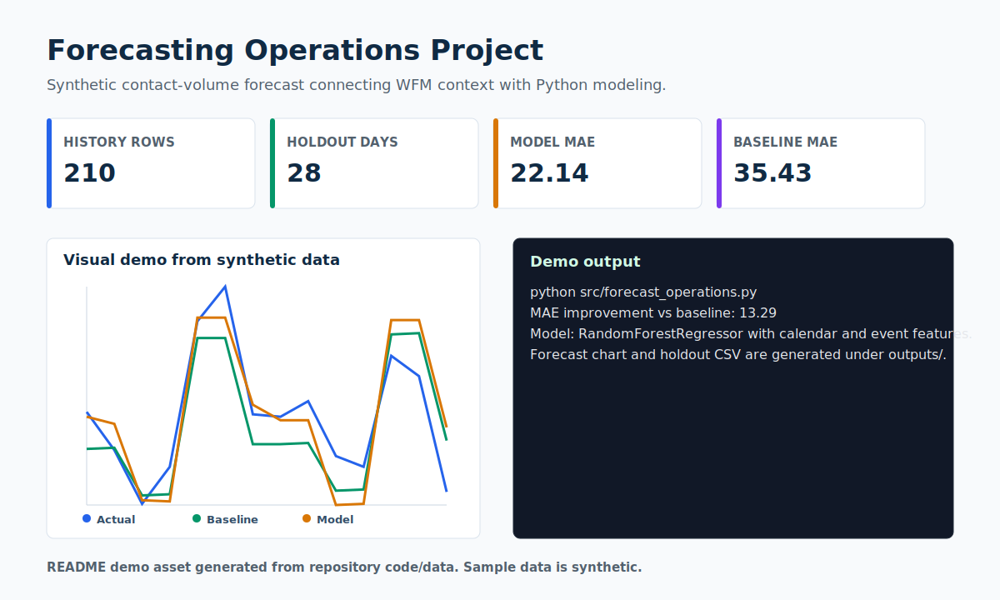

# Forecasting Operations Project

> A synthetic contact-volume forecasting demo grounded in workforce operations.



## Recruiter Snapshot

| 30-second question | Answer |
| --- | --- |
| Problem | WFM teams need to compare forecast assumptions against actual demand so staffing conversations are based on evidence. |
| My role | I created synthetic operations history, engineered calendar/event features, trained a RandomForestRegressor, and exported the holdout chart. |
| Result | On the 28-day synthetic holdout, the model reports MAE 22.14 versus baseline MAE 35.43. |
| Portfolio signal | Bridges operations forecasting intuition with Python modeling and honest metric reporting. |
| Data policy | All records are synthetic and safe for a public portfolio. |

## What I Built

- Calendar, weekend, event, and seasonality features.
- Baseline comparison instead of a standalone model score.
- Generated holdout CSV and forecast chart under `outputs/`.

## Evidence In This Repo

- `src/forecast_operations.py` trains and evaluates the model.
- `data/sample_synthetic_data.csv` has 210 synthetic daily rows.
- `assets/demo.svg` previews the holdout comparison.

## Tools And Concepts

`Python`, `pandas`, `scikit-learn`, `RandomForestRegressor`, `MAE`, `MAPE`, `matplotlib`

## Run Locally

```bash
python -m venv .venv
.venv\Scripts\activate
python -m pip install -r requirements.txt
python src/forecast_operations.py
```

## Limitations

This is a synthetic modeling exercise. The reported improvement is from generated data, not a business deployment.

## Next Iteration

- Add rolling-origin validation.
- Add prediction intervals or scenario bands.
- Add a short explanation of when the baseline is preferable.

## Data Privacy

Every record, identifier, organization, person, scenario, and result in this project is synthetic unless explicitly marked otherwise. No employer, client, university, colleague, customer, credential, private path, or sensitive personal record is used.
